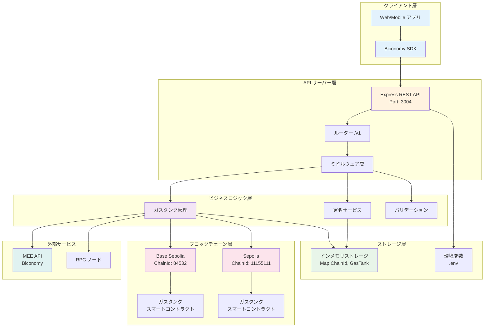
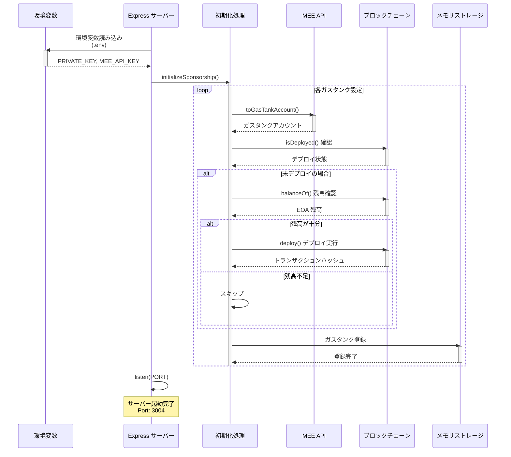
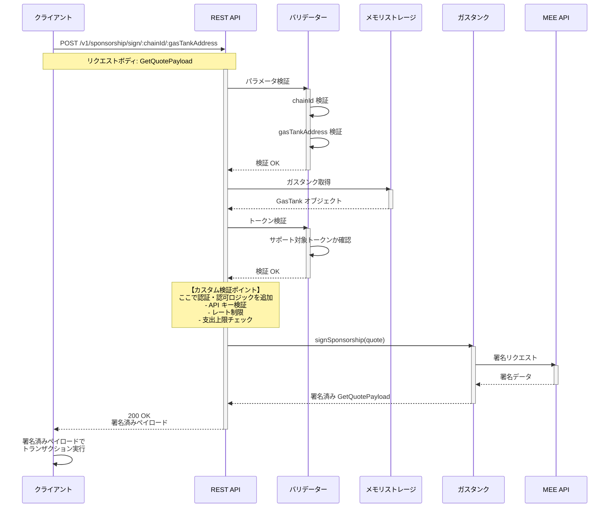
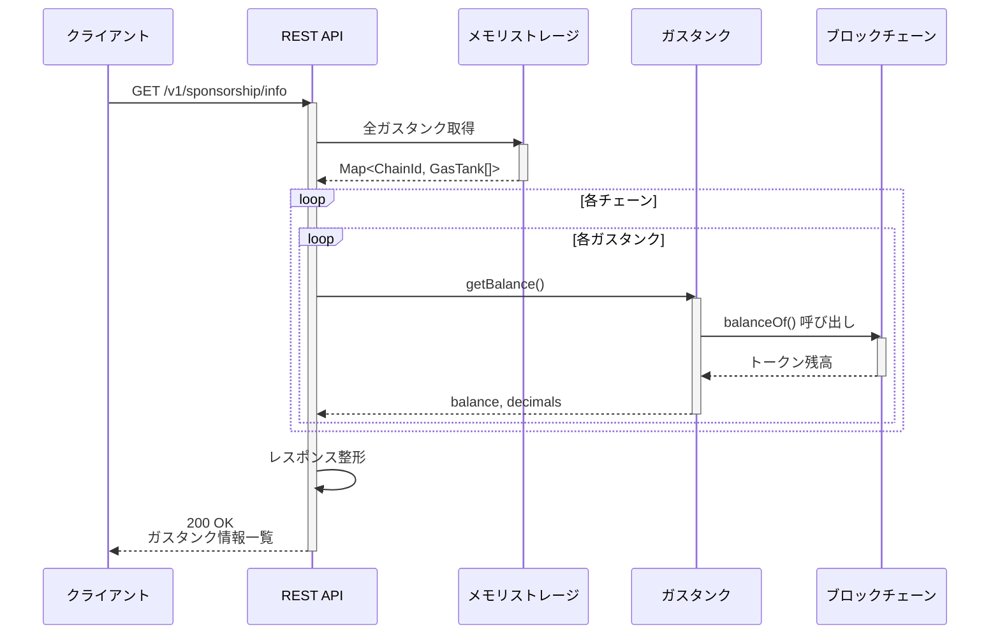
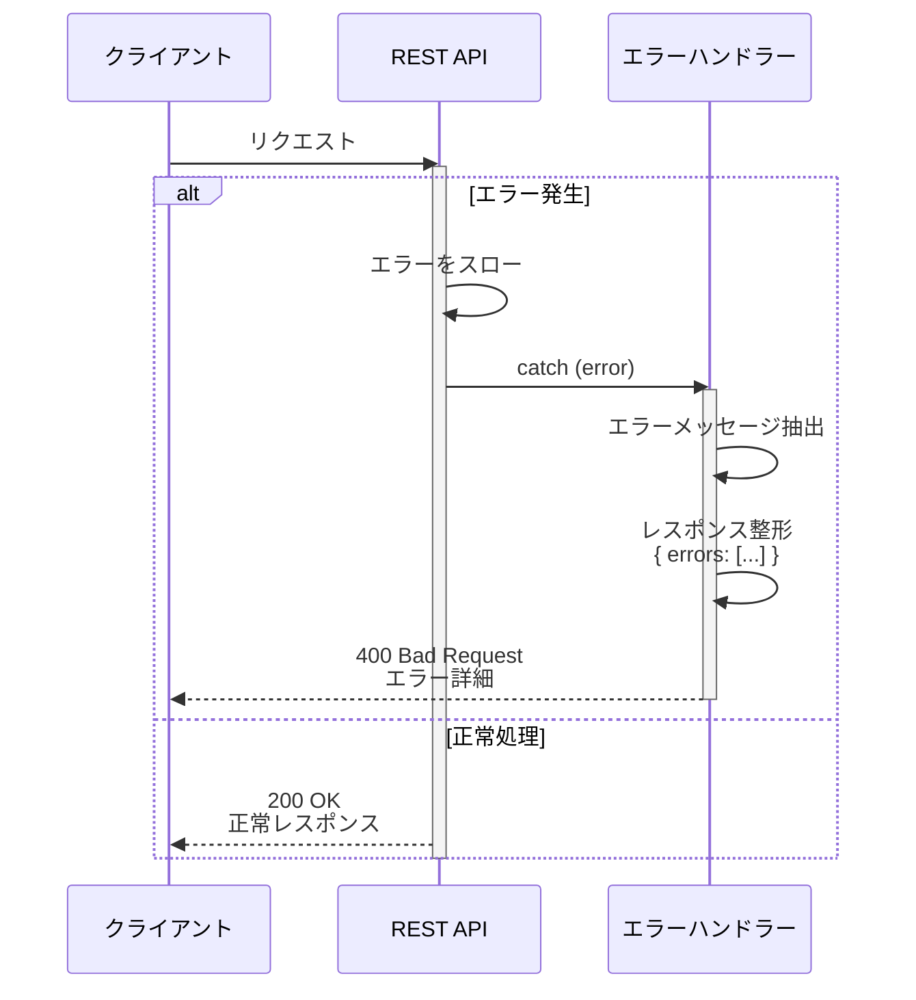

# 🚀 MEE セルフホスティング マルチチェーン ガススポンサーシップ サービス

<div align="center">

**Biconomy AbstractJS を使用した、マルチチェーン対応のガス代スポンサーシップ REST API サービス**

[](https://www.typescriptlang.org/)
[](https://bun.sh)
[](https://www.docker.com/)
[](https://biomejs.dev/)
[](LICENSE)

[日本語](#-概要) | [English](./README.en.md)

</div>

---

## 📑 目次

- [📖 概要](#-概要)
- [🏗️ システム構成図](#️-システム構成図)
- [✨ 機能一覧](#-機能一覧)
- [🔄 処理シーケンス図](#-処理シーケンス図)
- [🛠️ 技術スタック](#️-技術スタック)
- [🚀 セットアップと起動](#-セットアップと起動)
- [📚 API ドキュメント](#-api-ドキュメント)
- [🔒 セキュリティのベストプラクティス](#-セキュリティのベストプラクティス)
- [🐛 トラブルシューティング](#-トラブルシューティング)
- [🤝 コントリビューション](#-コントリビューション)

---

## 📖 概要

このプロジェクトは、**Biconomy AbstractJS** を活用したセルフホスティング型のマルチチェーンガススポンサーシップサービスです。

### 🎯 主な特徴

- 🌐 **マルチチェーン対応** - Base Sepolia、Sepolia など複数のブロックチェーンをサポート
- 💰 **ステーブルコインでのガス代支払い** - USDC 等のステーブルコインでガス代をスポンサー
- 🔐 **セキュアなガスタンク管理** - スマートコントラクトウォレットによる安全な資金管理
- ⚡ **高速・軽量** - Bun ランタイムと Biome による高速な開発体験
- 🐳 **Docker 対応** - コンテナ化されたデプロイメント
- 📊 **完全な API ドキュメント** - OpenAPI 3.0 仕様書付き
- 🔄 **自動ガスタンクデプロイ** - 起動時に自動でガスタンクをデプロイ

### 💡 使用例

- ユーザーのガスレストランザクションの実現
- DApp のオンボーディング体験向上
- バッチトランザクションのガス代最適化
- スマートコントラクトウォレットの操作

---

## 🏗️ システム構成図



---

## ✨ 機能一覧

| 機能カテゴリ | エンドポイント | メソッド | 説明 | 認証 |
|------------|--------------|---------|------|-----|
| **ガスタンク情報** | `/v1/sponsorship/info` | GET | 全チェーンのガスタンク情報を取得（残高、アドレス等） | 不要 |
| **Nonce 管理** | `/v1/sponsorship/nonce/:chainId/:gasTankAddress` | GET | 特定ガスタンクの現在の Nonce を取得 | 不要 |
| **トランザクション確認** | `/v1/sponsorship/receipt/:chainId/:hash` | GET | トランザクションレシート（受領証）を取得 | 不要 |
| **スポンサーシップ署名** | `/v1/sponsorship/sign/:chainId/:gasTankAddress` | POST | ガスタンクでトランザクションに署名（中核機能） | 推奨 |

### 📋 機能詳細

#### 1. ガスタンク情報取得
- **目的**: 利用可能なガスタンクとその残高を確認
- **返却データ**: チェーン ID、トークン残高、小数点桁数、ガスタンクアドレス
- **使用例**: フロントエンドでの残高表示、監視システムでの残高チェック

#### 2. Nonce 管理
- **目的**: トランザクションの順序管理
- **返却データ**: Nonce キー、現在の Nonce 値
- **使用例**: トランザクション送信前の Nonce 確認、リプレイ攻撃防止

#### 3. トランザクション確認
- **目的**: 送信したトランザクションの結果確認
- **返却データ**: ステータス、ガス使用量、イベントログ、ブロック情報
- **使用例**: トランザクション完了確認、ガス使用量の分析

#### 4. スポンサーシップ署名
- **目的**: ガスタンクでトランザクションに署名し、ガス代支払いを承認
- **入力データ**: トランザクション見積もり（GetQuotePayload）
- **返却データ**: 署名済み見積もり
- **使用例**: ユーザートランザクションのガス代スポンサー

---

## 🔄 処理シーケンス図

### 1️⃣ サーバー起動時の初期化フロー



### 2️⃣ スポンサーシップ署名フロー（メインフロー）



### 3️⃣ ガスタンク情報取得フロー



### 4️⃣ エラーハンドリングフロー



---

## 🛠️ 技術スタック

### コア技術

| カテゴリ | 技術 | バージョン | 用途 |
|---------|------|-----------|------|
| **ランタイム** | [Bun](https://bun.sh) | 1.2.9+ | 高速 JavaScript/TypeScript ランタイム |
| **言語** | [TypeScript](https://www.typescriptlang.org/) | 5.0+ | 型安全な開発 |
| **Web フレームワーク** | [Express.js](https://expressjs.com/) | 5.1.0 | REST API サーバー |
| **Web3 ライブラリ** | [Viem](https://viem.sh/) | 2.31.3 | Ethereum インタラクション |
| **スポンサーシップ** | [@biconomy/abstractjs](https://www.biconomy.io/) | 1.0.18 | ガスタンク・署名管理 |

### 開発ツール

| カテゴリ | 技術 | 説明 |
|---------|------|------|
| **リンター・フォーマッター** | [Biome](https://biomejs.dev/) | Rust 製の超高速ツール（ESLint + Prettier の代替） |
| **環境変数管理** | [dotenv](https://github.com/motdotla/dotenv) | .env ファイルの読み込み |
| **コンテナ** | Docker + Docker Compose | コンテナ化されたデプロイメント |
| **API ドキュメント** | OpenAPI 3.0 | Swagger Editor 対応 API 仕様書 |
| **API テスト** | REST Client | VS Code 拡張機能でのテスト |

### アーキテクチャパターン

- ✅ **レイヤードアーキテクチャ** - API 層、ビジネスロジック層、データ層の分離
- ✅ **依存性注入** - 疎結合な設計
- ✅ **環境変数による設定管理** - 環境ごとの柔軟な設定
- ✅ **エラーハンドリングミドルウェア** - 統一されたエラーレスポンス
- ✅ **インメモリストレージ** - 高速なガスタンク情報管理

---

## 🚀 セットアップと起動

### 📋 前提条件

- [Bun](https://bun.sh) 1.2.9 以降
- [Docker](https://www.docker.com/) & Docker Compose（Docker 使用時）
- [Git](https://git-scm.com/)

### 🔧 セットアップ手順

#### 1️⃣ リポジトリのクローン

```bash
git clone https://github.com/bcnmy/mee-self-hosted-sponsorship-starter-kit.git
cd mee-self-hosted-sponsorship-starter-kit
```

#### 2️⃣ 依存関係のインストール

```bash
bun install
```

#### 3️⃣ 環境変数の設定

```bash
# .env ファイルを作成
cp .env.example .env

# エディタで開いて編集
nano .env
```

**.env ファイルの設定例:**

```bash
# ==================== サーバー設定 ====================
PORT=3004
NODE_ENV=development

# ==================== ガスタンク設定 ====================
# ⚠️ 必須: EOA の秘密鍵（0x から始まる 64 文字の 16 進数）
PRIVATE_KEY=0xあなたの秘密鍵をここに設定

# ⚠️ 推奨: MEE API キー（本番環境では必須）
MEE_API_KEY=あなたの MEE API キーをここに設定
```

⚠️ **セキュリティ警告**:
- `.env` ファイルは Git にコミットしないでください
- 本番環境では暗号化された秘密管理サービスを使用してください
- 秘密鍵は絶対に共有しないでください

#### 4️⃣ 開発サーバーの起動

```bash
bun run dev
```

サーバーが起動したら: **http://localhost:3004**

---

### 🐳 Docker での起動（推奨）

#### 1️⃣ Docker Compose で起動

```bash
# バックグラウンドで起動
docker-compose up -d

# ログを確認
docker-compose logs -f

# 停止
docker-compose down
```

#### 2️⃣ Docker 単体での起動

```bash
# イメージをビルド
docker build -t mee-sponsorship-service .

# コンテナを起動
docker run -d \
  -p 3004:3004 \
  -e PRIVATE_KEY=0xYourPrivateKey \
  -e MEE_API_KEY=YourMeeApiKey \
  --name sponsorship-service \
  mee-sponsorship-service
```

#### 3️⃣ ヘルスチェック

```bash
# API が正常に起動しているか確認
curl http://localhost:3004/v1/sponsorship/info
```

---

### 🧪 API テスト

#### REST Client 拡張機能を使用（VS Code）

1. VS Code で `sample.http` ファイルを開く
2. 各リクエストの上に表示される **"Send Request"** をクリック
3. または `Ctrl+Alt+R` (Windows/Linux) / `Cmd+Alt+R` (Mac)

#### curl コマンドを使用

```bash
# ガスタンク情報を取得
curl http://localhost:3004/v1/sponsorship/info

# Nonce を取得
curl http://localhost:3004/v1/sponsorship/nonce/84532/0xYourGasTankAddress
```

---

### 🛠️ 開発コマンド

```bash
# 開発サーバー起動（ホットリロード）
bun run dev

# コードのリント
bun run lint

# コードの自動修正
bun run lint:fix

# コードのフォーマット
bun run format

# リント＆フォーマット（推奨）
bun run check
```

---

## 📚 API ドキュメント

### OpenAPI 仕様書

プロジェクトには完全な OpenAPI 3.0 仕様書が含まれています。

#### Swagger Editor で確認

1. [Swagger Editor](https://editor.swagger.io/) にアクセス
2. `openapi.yaml` をインポート
3. インタラクティブな API ドキュメントを確認

#### ローカルで Swagger Editor を起動

```bash
# Docker で起動
docker run -d -p 8080:8080 swaggerapi/swagger-editor

# ブラウザで開く
open http://localhost:8080
```

### エンドポイント一覧

| エンドポイント | 説明 | ドキュメント |
|--------------|------|-------------|
| `GET /v1/sponsorship/info` | ガスタンク情報取得 | [詳細](#1-ガスタンク情報取得) |
| `GET /v1/sponsorship/nonce/:chainId/:gasTankAddress` | Nonce 取得 | [詳細](#2-nonce-管理) |
| `GET /v1/sponsorship/receipt/:chainId/:hash` | レシート取得 | [詳細](#3-トランザクション確認) |
| `POST /v1/sponsorship/sign/:chainId/:gasTankAddress` | 署名実行 | [詳細](#4-スポンサーシップ署名) |

詳細は `openapi.yaml` または `sample.http` を参照してください。

---

## 🔒 セキュリティのベストプラクティス

### 🔐 秘密鍵の管理

- ✅ **環境変数を使用** - コードに直接埋め込まない
- ✅ **暗号化ストレージ** - AWS Secrets Manager、HashiCorp Vault 等を使用
- ✅ **.env ファイルを Git に含めない** - `.gitignore` で除外
- ✅ **権限の制限** - 必要最小限のアクセス権限のみ付与
- ❌ **絶対にコミットしない** - Git 履歴に秘密鍵を含めない

### 🛡️ API セキュリティ

#### 認証・認可の実装（推奨）

`/v1/sponsorship/sign` エンドポイントには認証を実装することを強く推奨します。

**実装例:**

```typescript
// カスタムヘッダーで API キーを検証
const apiKey = req.headers['x-api-key'];
if (!apiKey || apiKey !== process.env.VALID_API_KEY) {
  throw new Error('Unauthorized');
}
```

#### レート制限

```typescript
// 月間支出上限のチェック
const monthlySpent = await getMonthlySpending(projectId);
if (monthlySpent > MONTHLY_LIMIT) {
  throw new Error('Monthly spending limit exceeded');
}
```

### 💰 ガスタンク管理

- ✅ **ステーブルコインを使用** - USDC、DAI 等の安定した通貨
- ❌ **ネイティブトークンは非対応** - ETH、MATIC 等はサポート外
- ✅ **L2 ネットワークを活用** - Base、Optimism 等で低コスト化
- ✅ **残高監視** - 定期的な残高チェックとアラート設定
- ✅ **支出制限** - トランザクション毎の最大金額を設定

### 🔍 監視とロギング

```typescript
// トランザクション記録
console.log({
  timestamp: new Date().toISOString(),
  action: 'sponsorship_signed',
  chainId: chainId,
  gasTankAddress: gasTankAddress,
  amount: quote.paymentInfo.amount,
  sender: quote.sender,
});
```

---

## 🐛 トラブルシューティング

### よくある問題と解決方法

#### 1️⃣ `PRIVATE_KEY environment variable is not set`

**原因**: 環境変数 `PRIVATE_KEY` が設定されていない

**解決方法**:
```bash
# .env ファイルを確認
cat .env

# PRIVATE_KEY が設定されていることを確認
# 設定されていない場合は追加
echo "PRIVATE_KEY=0xYourPrivateKey" >> .env
```

#### 2️⃣ `Gas tank not found`

**原因**: 指定したガスタンクがメモリに存在しない

**解決方法**:
```bash
# ガスタンク情報を確認
curl http://localhost:3004/v1/sponsorship/info

# 返却されたガスタンクアドレスを使用
```

#### 3️⃣ `Not enough balance to deploy sponsorship gas tank account`

**原因**: EOA のトークン残高が不足

**解決方法**:
```bash
# EOA アドレスにテストトークンを送信
# Base Sepolia Faucet: https://www.coinbase.com/faucets/base-ethereum-goerli-faucet
# Sepolia Faucet: https://sepoliafaucet.com/
```

#### 4️⃣ Docker コンテナが起動しない

**原因**: ポート 3004 が既に使用されている

**解決方法**:
```bash
# 使用中のプロセスを確認
lsof -i :3004

# または別のポートを使用
docker-compose up -d -e PORT=3005
```

#### 5️⃣ Biome のエラー

**原因**: コードスタイルの問題

**解決方法**:
```bash
# 自動修正
bun run check

# または手動で修正してリントを実行
bun run lint
```

---

## 📁 プロジェクト構造

```
mee-self-hosted-sponsorship-starter-kit/
├── src/
│   └── index.ts                    # メインアプリケーション
├── .vscode/
│   ├── extensions.json             # 推奨 VS Code 拡張機能
│   └── settings.json               # VS Code プロジェクト設定
├── biome.json                      # Biome 設定
├── Dockerfile                      # Docker イメージ定義
├── docker-compose.yml              # Docker Compose 設定
├── openapi.yaml                    # OpenAPI 3.0 API 仕様書
├── sample.http                     # REST Client テストファイル
├── .env.example                    # 環境変数テンプレート
├── .env                           # 環境変数（Git 除外）
├── package.json                    # プロジェクト定義
├── tsconfig.json                   # TypeScript 設定
└── README.md                       # このファイル
```

---

## 🤝 コントリビューション

コントリビューションを歓迎します！

### 貢献方法

1. このリポジトリをフォーク
2. フィーチャーブランチを作成 (`git checkout -b feature/amazing-feature`)
3. 変更をコミット (`git commit -m 'Add amazing feature'`)
4. ブランチにプッシュ (`git push origin feature/amazing-feature`)
5. プルリクエストを作成

### 開発ガイドライン

- ✅ Biome でコードをフォーマット (`bun run check`)
- ✅ 型安全性を保つ（TypeScript strict mode）
- ✅ わかりやすいコメントを追加
- ✅ API 仕様書（openapi.yaml）を更新
- ✅ テストケース（sample.http）を追加

---

## 📄 ライセンス

このプロジェクトは [MIT License](LICENSE) の下でライセンスされています。

---

## 🙏 謝辞

- [Biconomy](https://www.biconomy.io/) - AbstractJS SDK と MEE API の提供
- [Bun](https://bun.sh) - 高速な JavaScript ランタイム
- [Viem](https://viem.sh/) - 優れた Ethereum ライブラリ

---

## 📞 サポート

問題や質問がある場合は、以下の方法でお問い合わせください:

- 🐛 **Issue を作成**: [GitHub Issues](https://github.com/bcnmy/mee-self-hosted-sponsorship-starter-kit/issues)
- 💬 **Discord**: [Biconomy Discord](https://discord.gg/biconomy)
- 📧 **Email**: support@biconomy.io
- 📚 **ドキュメント**: [Biconomy Docs](https://docs.biconomy.io/)

---

<div align="center">

**🌟 このプロジェクトが役に立った場合は、ぜひスターをお願いします！ 🌟**

Made with ❤️ by [Biconomy](https://www.biconomy.io/)

</div>
